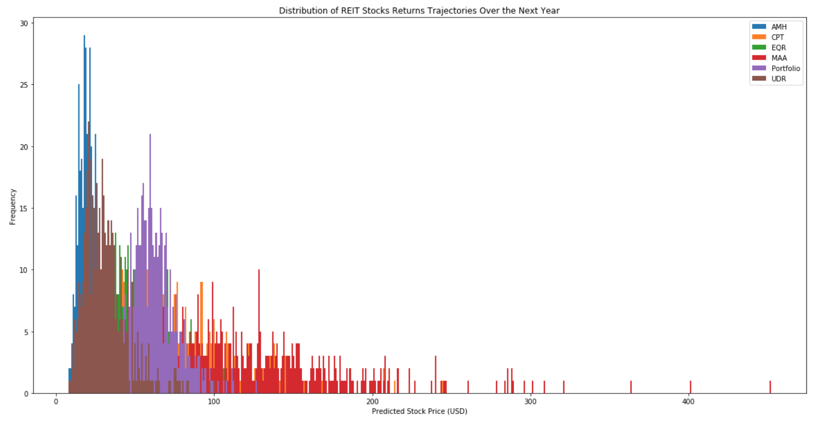

# TopTick
## Welcome to TopTick! Your dashboard for daily discovery of tradable equities.
---
## About TopTick:
TopTick is a comprehensive guide for investors of all kinds. We scan the market for the best relatively unknown equities that are primed for steady and safe growth. We have selected the housing market and REIT stocks to demonstrate the the dashboard. With this demonstration, we can help you decide if investing in residential real estate based stocks versus buying a single family home accross nation. We will also determine stock is the best buy and which state is most likely to have the highest return on single family homes.

## What you will find on TopTick
Our goal in creating this dashboard, is to analyze REIT stocks and compare them with the housing market. This tool can be applied to any stock data and aid in the discovery of solid stocks that many investors may have not heard of. To fulfill this goal, it is recommend not to analyze stock groups that have a market caps larger than $25 billion. 

Our daily top 5 buy's are stocks that meet all of our criteria for a good, investable asset. This same concept can be applied to any other type of asset with historical price data that can be purchased. 

Please see the later section on data analysis and selction of top 5 stocks and states based on data described below.

### Monte Carlo simulator
Based on our analysis of our top 5 buy's, the Monte Carlo simulation will give investors an even deeper look into the potential future earnings of a portfolio with our picks in them. The weights are set to provide balanced portfolio for equal investment in all 5 assets. The time prediction is set to estimate potential returns after 1 years time. 

Here are the obtained results showing distributions of the potential ending values at 1 year from now for the current top 5 REIT and top 5 states for single family home values. These assets were selected based on beta values.

## How we analyze our picks: the core metrics behind our discovery of safe assets

### Daily Percent Change
Daily percent change, the calculation of how much return a certain asset sees over the last trading day, is a building block for many more complex metrics, but is important in its own right. 

### Standard Deviation
The standard deviation of an equity is on way to measure how volitile that asset is. By tracking how often the equity exceeds its typical price bounds, you can tell whether or not that asset is likely to follow its current trend or see large fluctuations on any given day.

### Beta
For this tool, we will measure the beta against the S&P 500. An equities beta shows the volatility measured against the market as a whole. In this case a beta close to one is a stock that, on average, will see gains when the S&P 500 see's gains, and vice versa. 

### Sharpe Ratio
The sharpe ratio will determine the return of the investment versus the risk factor of the asset. The greater the value in the sharpes ratio the more attractive the risk adjusted return. 

### Top 5 of the REIT stocks
In this section, the REIT stocks are compared to the S&P 500. With our smart filters, we have narrowed down the stocks for the day to 5 stocks. With these plots will help the investors to choose a potential stock. The percentage change is measured with the 5 best stocks, as well is with beta values and the top sharpes ratios are displayed. The resulting data is shown below:

### Top 5 State Price Housing
Here are displayed the housing prices to compare against the REIT stocks. The state housing prices have been filtered to 5 top states to purchase a single family housing unit. The percent change, beta values, and the sharpe ratio is displayed for each top state to help an investor determine risk versus reward. The resulting data is shown below.

### Scatter Map
Displayed are the top 5 states where the color and size is the average return of the housing prices. 

---
## Disclaimer
Because whats an investing site without a liability disclaimer?
The market can be unpredicatable, potential investors should always do independent research before purchasing an investment. TopTick is not a guarantee that a stock will make you money or perform in the way we predicted, it is only a guide that contains potentially useful information. Please use caution when investing, and never spend money that you cannot afford to lose.

For the inexperienced investor, always consult a trained and certified financial advisor.